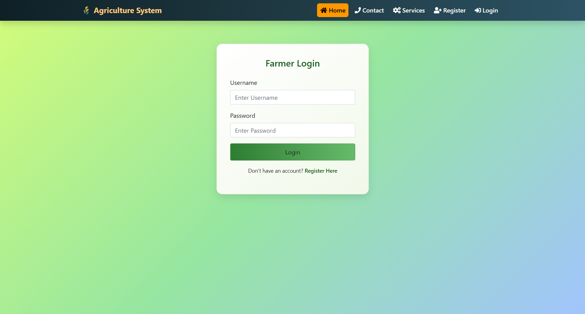

🌾 Agriculture Management System

A web-based Agriculture Management System developed using Java Servlets, JSP, JDBC, MySQL, HTML, CSS, and Bootstrap. This application allows farmers to register, log in, add crop details, manage crop sales, and maintain agricultural records digitally. The system reduces manual paperwork and improves efficiency through database-driven automation.

📌 Project Overview

The Agriculture Management System is designed to:

*   Digitally manage farmer records
*   Store and update crop information
*   Handle crop purchases
*   Maintain real-time data in a MySQL database
*   Provide a simple and responsive user interface

This project follows a basic MVC (Model-View-Controller) architecture using Servlets and JSP.

🛠️ Technologies Used

*   Backend: Java Servlets, JSP
*   Database: MySQL
*   Connectivity: JDBC
*   Frontend: HTML, CSS, Bootstrap
*   Server: Apache Tomcat
*   IDE: Eclipse

  
  🗂️ Project Structure
Agriculture-Management-System/
│
├── src/
│   ├── LoginServlet.java
│   ├── RegisterServlet.java
│   ├── AddCropServlet.java
│   ├── BuyCropServlet.java
│   ├── ViewCropServlet.java
│   ├── DBConnection.java
│
├── WebContent/
│   ├── css/
│   │   └── style.css
│   │
│   ├── images/
│   │
│   ├── farmerLogin.jsp
│   ├── farmerRegister.jsp
│   ├── farmerHome.jsp
│   ├── addCrop.jsp
│   ├── buyCrop.jsp
│   ├── viewCrop.jsp
│   ├── index.jsp
│   │
│   └── WEB-INF/
│       └── web.xml
│
├── lib/
│   └── mysql-connector-java.jar
│
└── agriculture.sql

📸 Screenshots

(Add your images inside a folder named screenshots and use:)

🗄️ Database Setup

1️⃣ Create Database
CREATE DATABASE agriculture;
USE agriculture;

2️⃣ Create Farmer Table
CREATE TABLE farmer (
    id INT PRIMARY KEY AUTO_INCREMENT,
    full_name VARCHAR(100) NOT NULL,
    mobile_number VARCHAR(15) NOT NULL,
    username VARCHAR(50) UNIQUE NOT NULL,
    password VARCHAR(100) NOT NULL
);

3️⃣ Create Crop Table
CREATE TABLE crop (
    id INT PRIMARY KEY AUTO_INCREMENT,
    crop_name VARCHAR(100) NOT NULL,
    crop_type VARCHAR(100) NOT NULL,
    quantity INT NOT NULL,
    price DECIMAL(10,2) NOT NULL
);

🚀 Features

*   👨‍🌾 Farmer Registration
*   🔐 Secure Login Authentication
*   🌱 Add Crop Details
*   🛒 Buy Crop Functionality
*   📊 View Crop Records
*   🔄 Automatic Quantity Update After Purchase
